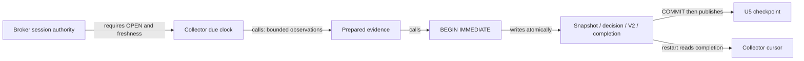
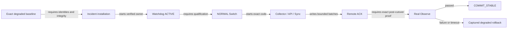
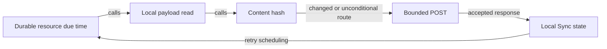

# Recovery closure boundary audit

Status: PARTIAL. Inspection precedes remaining recovery edits; not deployment
authority. Main is `5d3803087c435402c12369713f6a4dc136711cff`.
Initial WIP tracked binary diff SHA-256 is
`9bbd0c4518fc82c75adea235aaac3efc50d705bf833fe8bc086b6288a1b5dad4`.
The separate untracked recovery plan SHA-256 is
`18eae92996602aadd85940976b4c8be0c893c3c64903409ecc30ea813375ba20`.
These identities describe the initial uncommitted input. The preserved clean
checkpoint is `b5087bbaa94094b00f369c7d0879ce57b45d5381`; subsequent changes require
new exact-source evidence and do not inherit its identity.

## Recovery ACK boundary

The existing News store returns operation results, while Sync previously ignored
stage/activation results and treated malformed HTTP success as an empty object.
The correction adds exact-request SHA-256, snapshot and contract fields to the
existing successful HTTP response and validates all required operation fields
before local progress. No D1 schema or receipt family is introduced. Replayed
batch protection remains the existing persisted store contract.

The versioned `scripts/rehearse_news_recovery_copy.py` producer uses the real API,
continuous Sync, and real Worker store with an isolated SQLite D1 adapter. It
requires clean source and writes reports outside source. Its critical-status
input is an explicit adapter; it is not a full lifecycle or Cloudflare proof.
Old-query equivalence and Switch/Observe remain NOT_RUN until actually executed.
The historical 126.935-second receipt-sharing failure and dirty-source
90.184-second resource run remain retained diagnostic evidence, not clean-source
release acceptance.

The clean `82bd1dcc` resource run completed in 90.672 seconds. The clean
`7e47ca13` run additionally compared all 1,919 source/stored records through the
existing canonical digest and completed in 91.324 seconds. Both used 479 local
News GETs, 240 prepare, 240 stage, one activate and one cleanup POST, plus four
independent heartbeats. The second run again exposed a transient Windows
receipt-sharing failure before final recovery. Neither run proves the complete
degraded lifecycle. Later source changes invalidate exact-target reuse.

The existing Sync JSON writer now retries only its atomic replace on transient
Windows sharing/access errors for at most 70 milliseconds. It uses an owned
unique temporary file and preserves the previous checkpoint on persistent
failure. It never replays an accepted HTTP request to resolve a local file
sharing conflict. Real Windows reader-hold and persistent-conflict tests cover
this boundary; the producer retains observed transient failure families.

## Remaining connected rehearsal work

Use the existing NORMAL `Start-ReleasePromotion` chain, not a second engine.
The staged fixture still overrides runtime health and process matching and
does not run real Switch/Observe. A full isolated source history, real service
launches, exact receipt producers and captured degraded rollback are still
required. Provider/scheduler adapters must be declared, including a deny-by-
default network boundary and loopback port translation. Do not execute the
fixed production API port or user scheduled-task names in a fixture.

Collector snapshot-only exclusion belongs to the existing controlled repair
entrypoint; launching Collector alone does not perform that repair. Retain its
order in the connected chain. NORMAL Observe requires actual decision cycles;
closed-market observation pauses rather than inventing decisions. Existing TLC
passes do not yet prove the newly added deferred-ACK/progress integration.

## Initial problem table

| Boundary / inspected source | Confirmed result | Required correction and evidence |
| --- | --- | --- |
| P1: `run_forward_collector.append_due_grid_events`, `ForwardEngine.append_clock_event` | No-due/session checks precede prediction observations; completion is inside the necessary-write transaction, U5 publication follows commit | Preserve #455; reuse crash/restart tests. Independent exit checkpoint observations are not covered by the new-decision no-read result. |
| P2: `Assert-CollectorNewsRecoveryEvidence` | Caller assertions and literal historical digests do not verify actual rehearsal artifact bytes or target execution | Bind and independently verify the measured source/artifact; do not manufacture missing proof fields. |
| P2: `sync_deferred_projection_once` -> `run_continuous_sync` | Empty pending result prevents immediate heavy-owner drain; 240 pages at 30 seconds exceed the 15-minute Observe deadline | Expose genuine bounded page progress without claiming success; execute the continuous owner. No timeout increase. |
| P2: staged boundary fixture | `Test-RuntimeObservation` override bypasses real resource acceptance | Full degraded-start rehearsal must retain real Observe and commit rejection, separately identifying external fixture adapters. |
| P3: learning/market/retry/News Sync | Payload reads precede hash checks; some unchanged work still sends requests | Separate efficiency change after recovery; source revision, ACK validity and due work must precede payload construction. |

## Observed topology and transaction

These are bounded source-inspection diagrams, not a complete generated index.
Calls are distinguished from writes and prerequisites. Dynamic dispatch and
provider execution not exercised here remain UNKNOWN.

The last graph describes existing P3 ordering, **not** the desired source-first
implementation. Current-main and initial WIP share these ordinary Sync paths;
WIP adds the deferred P2 path only. A complete parser-derived index, exact-span
edge inventory, before/after graphs and mutation evidence remain outstanding.

## Immediate scheduling change contract

The existing serial heavy executor remains the only Sync owner. One invocation
retains the existing one-page/item/byte bounds. Only a changed durable staging
cursor may produce PROGRESS; no change waits for the existing heartbeat wakeup.
PROGRESS cannot clear a retained resource failure or produce a COMPLETED receipt.
An actual error must not trigger an immediate repeated deferred operation.
Restart reads the existing request and cursor. No new durable state or receipt
family is required. Ordinary Audit acceptance and exact Worker verification
remain unchanged. Tests must execute the continuous scheduler and preserve
independent heartbeats, accepted Audit work, and bounded failure behavior.

## Evidence limits

The prior copied API/Sync loop proves resource transport, not real scheduling or
production recovery. The current staged ACTIVE test proves handoff, not real
Observe. Existing TLC PASS is unchanged-model evidence, not proof of newly added
transitions. All four campaign completion surfaces remain incomplete.

## Continuation measurements

The continuous-owner correction passed 114 Sync/deferred-parity tests; the
focused installation evidence tests passed on Windows PowerShell 5.1 and
PowerShell 7. Counts are suite results, not additive unique coverage.

On the retained independent database copy, real API News reads, real continuous
Sync dispatch, and the isolated HTTPS receiver completed 1,919 records with
482 business POSTs (maximum 25,972 bytes), 719 local News GETs (maximum 5.951
seconds), four heartbeat requests, and final normal Sync status OK in 90.184
seconds. This is not production D1 usage or full Switch/Observe evidence.
The run used base `5d3803087c435402c12369713f6a4dc136711cff` plus dirty tracked
diff `ae9b8fc975ae6319a0b9709099da97269565dd72bacb0d3986ac4a3944411d1e`.
An earlier 126.935-second run reached ACK but stopped before final normal status;
it exposed transient Windows receipt-sharing failures and is not final-health
proof. Both outcomes remain retained. No generation, ACK or error was manually
changed in production.

The artifact consumer now rejects missing/tampered reports, dirty source,
wrong exact source and direct-helper execution reports. A clean-source measured
artifact producer and full lifecycle integration remain required; accepting a
well-formed report alone is not a claim of independently authenticated execution.

## Deferred efficiency findings

Unchanged source work remains concrete, not hypothetical: learning fetches
before hashing; market posts chart/overview each scheduled invocation; retry
mirror reads its complete local list before digest comparison; News builds
SQL rows before frozen-manifest reuse. Learning revision currently performs
eight table counts. The independent exit-checkpoint Collector path also reads
observations before checkpoint eligibility. These are separate efficiency work,
not reasons to alter already-verified clock atomicity.

The shared POST reader turns malformed/empty/non-object successful HTTP bodies
into an empty object; several callers advance local state without a positive
operation-specific ACK. Actual provider occurrence is UNKNOWN. Source-first
changes must correct this producer-consumer ACK contract, not just cache hashes.

## Clean-source resource checkpoint

The versioned `rehearse_news_recovery_copy.py` now executes the real local API,
continuous Sync, exact-byte Worker ACK boundary and an independent subprocess
running the normal deferred consumer. The provider remains loopback TLS with
the real Worker store on the existing in-memory SQLite D1 adapter; identity
headers and critical-status input are declared adapters, not Cloudflare proof.

Clean source `c3f35a2216da6aad26bc7de49035eaf78c6244ba` completed in 91.344s:
1,919 rows, matching source/stored content digests, 479 local payload GETs,
482 business POSTs, four heartbeats and an independently accepted deferred
receipt. The GET reduction from719 removes the redundant first-page read;
it is not source-first no-change acceptance. POST attribution is prepare240,
stage240, activate1, cleanup1. One additional remote GET reconciles the ACK.
D1 rows read/written are NOT_MEASURED, not inferred from HTTP counts.

The earlier exact-source `7e47ca13` run had transient Windows receipt-sharing
failure despite eventual recovery. The existing atomic Sync writer now retries
only the exact rename with a bounded70ms sharing allowance and never repeats an
accepted business POST for that reason. Later clean `290ddfeb` and `c3f35a22`
resource runs observed no such failure. Earlier failed evidence is retained.

Review found that HTTP handler threads also need explicit cleanup ownership.
The producer now registers each before launch, joins them under one bounded
deadline, and retains the temporary runtime with UNRESOLVED cleanup if any
remain. It also resolves Windows path aliases before recording ownership.
Evidence from earlier source remains labeled with that source, not relabeled.

The existing core formal shard now models deferred pending/accepted/rejected
or expired transitions after Switch. Commit requires the exact accepted key;
rejection/expiry uses normal recovery. This does not complete the real
degraded-start installation/Switch/Collector/Observe rehearsal. Old-query
reproduction and old/new full result equivalence remain NOT_RUN in this
producer, so it cannot authorize the incident admission or production mutation.
