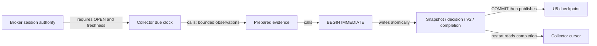
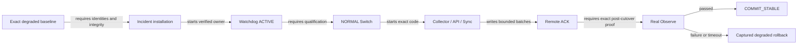
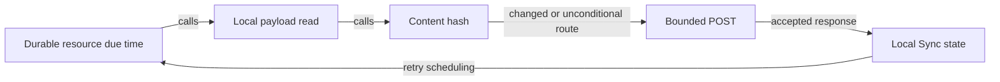

# Recovery closure boundary audit

Status: PARTIAL. Inspection precedes remaining recovery edits; not deployment
authority. Main is `5d3803087c435402c12369713f6a4dc136711cff`.
Initial WIP tracked binary diff SHA-256 is
`9bbd0c4518fc82c75adea235aaac3efc50d705bf833fe8bc086b6288a1b5dad4`.
The separate untracked recovery plan SHA-256 is
`18eae92996602aadd85940976b4c8be0c893c3c64903409ecc30ea813375ba20`.
These identities describe uncommitted input, not an exact committed source.

## Initial problem table

| Boundary / inspected source | Confirmed result | Required correction and evidence |
| --- | --- | --- |
| P1: `run_forward_collector.append_due_grid_events`, `ForwardEngine.append_clock_event` | No-due/session checks precede prediction observations; completion is inside the necessary-write transaction, U5 publication follows commit | Preserve #455; reuse crash/restart tests. Independent exit checkpoint observations are not covered by the new-decision no-read result. |
| P2: `Assert-CollectorNewsRecoveryEvidence` | Caller assertions and literal historical digests do not verify actual rehearsal artifact bytes or target execution | Bind and independently verify the measured source/artifact; do not manufacture missing proof fields. |
| P2: `sync_deferred_projection_once` -> `run_continuous_sync` | Empty pending result prevents immediate heavy-owner drain; 240 pages at 30 seconds exceed the 15-minute Observe deadline | Expose genuine bounded page progress without claiming success; execute the continuous owner. No timeout increase. |
| P2: staged boundary fixture | `Test-RuntimeObservation` override bypasses real resource acceptance | Full degraded-start rehearsal must retain real Observe and commit rejection, separately identifying external fixture adapters. |
| P3: learning/market/retry/News Sync | Payload reads precede hash checks; some unchanged work still sends requests | Separate efficiency change after recovery; source revision, ACK validity and due work must precede payload construction. |

## Observed topology and transaction

These are bounded source-inspection diagrams, not a complete generated index.
Calls are distinguished from writes and prerequisites. Dynamic dispatch and
provider execution not exercised here remain UNKNOWN.

The last graph describes existing P3 ordering, **not** the desired source-first
implementation. Current-main and initial WIP share these ordinary Sync paths;
WIP adds the deferred P2 path only. A complete parser-derived index, exact-span
edge inventory, before/after graphs and mutation evidence remain outstanding.

## Immediate scheduling change contract

The existing serial heavy executor remains the only Sync owner. One invocation
retains the existing one-page/item/byte bounds. Only a changed durable staging
cursor may produce PROGRESS; no change waits for the existing heartbeat wakeup.
PROGRESS cannot clear a retained resource failure or produce a COMPLETED receipt.
An actual error must not trigger an immediate repeated deferred operation.
Restart reads the existing request and cursor. No new durable state or receipt
family is required. Ordinary Audit acceptance and exact Worker verification
remain unchanged. Tests must execute the continuous scheduler and preserve
independent heartbeats, accepted Audit work, and bounded failure behavior.

## Evidence limits

The prior copied API/Sync loop proves resource transport, not real scheduling or
production recovery. The current staged ACTIVE test proves handoff, not real
Observe. Existing TLC PASS is unchanged-model evidence, not proof of newly added
transitions. All four campaign completion surfaces remain incomplete.

## Continuation measurements

The continuous-owner correction passed 114 Sync/deferred-parity tests; the
focused installation evidence tests passed on Windows PowerShell 5.1 and
PowerShell 7. Counts are suite results, not additive unique coverage.

On the retained independent database copy, real API News reads, real continuous
Sync dispatch, and the isolated HTTPS receiver completed 1,919 records with
482 business POSTs (maximum 25,972 bytes), 719 local News GETs (maximum 5.951
seconds), four heartbeat requests, and final normal Sync status OK in 90.184
seconds. This is not production D1 usage or full Switch/Observe evidence.
The run used base `5d3803087c435402c12369713f6a4dc136711cff` plus dirty tracked
diff `ae9b8fc975ae6319a0b9709099da97269565dd72bacb0d3986ac4a3944411d1e`.
An earlier 126.935-second run reached ACK but stopped before final normal status;
it exposed transient Windows receipt-sharing failures and is not final-health
proof. Both outcomes remain retained. No generation, ACK or error was manually
changed in production.

The artifact consumer now rejects missing/tampered reports, dirty source,
wrong exact source and direct-helper execution reports. A clean-source measured
artifact producer and full lifecycle integration remain required; accepting a
well-formed report alone is not a claim of independently authenticated execution.

## Deferred efficiency findings

Unchanged source work remains concrete, not hypothetical: learning fetches
before hashing; market posts chart/overview each scheduled invocation; retry
mirror reads its complete local list before digest comparison; News builds
SQL rows before frozen-manifest reuse. Learning revision currently performs
eight table counts. The independent exit-checkpoint Collector path also reads
observations before checkpoint eligibility. These are separate efficiency work,
not reasons to alter already-verified clock atomicity.

The shared POST reader turns malformed/empty/non-object successful HTTP bodies
into an empty object; several callers advance local state without a positive
operation-specific ACK. Actual provider occurrence is UNKNOWN. Source-first
changes must correct this producer-consumer ACK contract, not just cache hashes.
