# Repository Modularization Closure Audit — 2026-08-24

## Architecture evidence compiler campaign refresh — 2026-08-26

This section supersedes every older SHA, test count, Preview, merge-order, and
closure statement below. The older sections remain only as historical evidence
for the earlier #304 campaign boundary. The complete stack is still `PENDING`:
all implementation PRs and this documentation-only closure PR remain Draft.

- Latest integrated `main`: `ae8b4d0a28d69075d2b78ff76447345ca72bb39f`
  (#340).
- Final implementation: Draft PR #328 at
  `91030a458f5ae1bfc9da59854afb6d910d35b977`.
- Closure: Draft PR #302, documentation-only, based directly on #328.
- Assistant remains `PAUSED`.
- No merge, Stable movement, production data mutation, provider call, runtime
  activation, or production deployment was performed.

### Exact refreshed stack

Each implementation base is the exact head of the preceding row. #302 uses a
live head OID because a commit cannot embed its own hash.

| Order | PR | Branch | Exact base SHA | Exact head SHA |
|---:|---:|---|---|---|
| 1 | #282 | `docs/architecture-baseline` | `ae8b4d0a28d69075d2b78ff76447345ca72bb39f` | `ded6337b6fabd9c9b7a8ee1c174de1b23d6d8070` |
| 2 | #283 | `refactor/dashboard-status-cache` | `ded6337b6fabd9c9b7a8ee1c174de1b23d6d8070` | `b3a389312f4f30054fd863f690d544df40d036e8` |
| 3 | #285 | `refactor/dashboard-health-projection` | `b3a389312f4f30054fd863f690d544df40d036e8` | `66963502f848334fbf61284e9dfc34d5e6108fc7` |
| 4 | #287 | `refactor/dashboard-resource-contracts` | `66963502f848334fbf61284e9dfc34d5e6108fc7` | `66032d1673aaf91d3658ddc36069a0238886440f` |
| 5 | #288 | `refactor/dashboard-api-news-resources` | `66032d1673aaf91d3658ddc36069a0238886440f` | `e14e024ebd8c21bb56086e95542fbe9006b53b3e` |
| 6 | #289 | `refactor/dashboard-api-market-resources` | `e14e024ebd8c21bb56086e95542fbe9006b53b3e` | `b2085af610135f94fce521904bbc18b4efbdd49b` |
| 7 | #290 | `refactor/dashboard-api-optional-resources` | `b2085af610135f94fce521904bbc18b4efbdd49b` | `00fcfd4ccbc85bcc14801de8114a0b87782b3768` |
| 8 | #291 | `refactor/dashboard-operator-bridge` | `00fcfd4ccbc85bcc14801de8114a0b87782b3768` | `fbcdb8b07d7844a941e6ed2bca0f2980e5b3951d` |
| 9 | #292 | `refactor/dashboard-sync-runtime` | `fbcdb8b07d7844a941e6ed2bca0f2980e5b3951d` | `98115ecc8a55f2b6437c51fa983821382f8b7cc6` |
| 10 | #294 | `refactor/news-annotator-runtime` | `98115ecc8a55f2b6437c51fa983821382f8b7cc6` | `46393e43f30a1de22e710accf2ec1c1c131a54ea` |
| 11 | #295 | `refactor/control-center-boundaries` | `46393e43f30a1de22e710accf2ec1c1c131a54ea` | `3a371f7d12ddcee20645d832ee1e9302779a4184` |
| 12 | #296 | `refactor/decision-evidence-packages` | `3a371f7d12ddcee20645d832ee1e9302779a4184` | `c5029a38ad1076a850b4816cc31db12013d15d57` |
| 13 | #297 | `refactor/training-package` | `c5029a38ad1076a850b4816cc31db12013d15d57` | `602d4b855791d114add0ec7188874309c575d4f0` |
| 14 | #298 | `refactor/news-ai-packages` | `602d4b855791d114add0ec7188874309c575d4f0` | `5b0366443736ec2fead40f1da2979ff3689ff9f1` |
| 15 | #299 | `refactor/assistant-runtime-dashboard-packages` | `5b0366443736ec2fead40f1da2979ff3689ff9f1` | `29e6a8ed56147842a12da43bad501dab0a907555` |
| 16 | #301 | `refactor/test-organization` | `29e6a8ed56147842a12da43bad501dab0a907555` | `8c3db99bbef531eb1d8c72698b2b71972716113e` |
| 17 | #304 | `feat/private-architecture-explorer` | `8c3db99bbef531eb1d8c72698b2b71972716113e` | `acb063702245745da10afd5fa36d5dcebfd69808` |
| 18 | #321 | `feat/architecture-source-compiler` | `acb063702245745da10afd5fa36d5dcebfd69808` | `a653e4d9954c6a97f927409f5a5242612b2b01ff` |
| 19 | #324 | `test/architecture-contract-evidence` | `a653e4d9954c6a97f927409f5a5242612b2b01ff` | `73e80b384b17b778b04f42bf50f700cdf96afa5b` |
| 20 | #325 | `test/architecture-mutation-audit` | `73e80b384b17b778b04f42bf50f700cdf96afa5b` | `8cdef3eded58e9b76ea1401f559c00499e67b98f` |
| 21 | #328 | `feat/architecture-evidence-explorer` | `8cdef3eded58e9b76ea1401f559c00499e67b98f` | `91030a458f5ae1bfc9da59854afb6d910d35b977` |
| 22 | #302 | `chore/modularization-campaign-closure` | `91030a458f5ae1bfc9da59854afb6d910d35b977` | live PR #302 head OID |

The #326 News Evidence cleanup and #327 staging-ownership behavior were repaired
at their lowest extracted owner in #292. #329's single-pass News validation was
preserved through #288, #330's byte-preserving D1 snapshot boundary was
preserved through the full stack, #332's pending-decision preflight behavior
was moved with its authoritative production-shape owner in #299, #333's
large-snapshot D1 transport adaptation is preserved through the complete Web
stack, #334's audit-stories CPU headroom repair remains intact, #336's live
news metric authority follows the canonical payload owner through #299, and
#337's release-handover fallback preserves missing versus zero semantics in the
Web/Worker surface, and #338's bounded News metric seed is owned by the extracted
release module in #295 while public reads remain bounded. #339's split audit
story rendering remains in the Web presentation layer and is preserved through
the complete stack. #340's legacy News reverse projection and Stable health
gate are preserved in #295's canonical release module; #321 classifies its Web
SQL fixture as test evidence without granting production writer authority. #283 also
restores the status-cache test clock import, and #287 explicitly
permits the one News bootstrap transition until #292 removes
that script-to-script dependency. The thin `scripts/run_dashboard_sync.py` entry delegates
through the replaceable transport seam; the canonical implementation remains in
`xauusd_forecaster.dashboard.sync.resource_protocols`. The complete Dashboard
Sync contract family passed 77/77 before descendants were replayed.

Exact-head CI repair retains News projection ownership in #287 until #288
extracts it; 113 Dashboard API tests pass at that intermediate boundary. #325
removes Unix dependency symlinks with `unlink` while preserving Windows junction
removal, so the family test and seven-mutant smoke profile finish without
traversing the installed dependency target.

### Compiler and test-effectiveness evidence

- Static compiler: 5,675 current source facts, 103 high-level claims, no absolute
  workspace paths, deterministic second pass, and zero import-policy violations.
- Generated Explorer: 37 nodes, 66 edges, 11 views, four scenarios, and a
  52,368-byte high-level manifest; detailed code and evidence indexes remain
  separate private lazy artifacts.
- Contract registry: 16 critical contracts, 15 unique executed test identities,
  10 normalized source-bound runtime traces, and a 1,681-test inventory (987
  owner-touching and 1,666 not contract-classified; sets overlap by design).
- Full mutation pilot: 12 valid mutations; 9 `KILLED`, 3 `SURVIVED`, 0
  `INVALID`, 0 `TIMEOUT`, and 0 `ERROR`.
- Explicit survivors: `MUT-SYNC-HEARTBEAT-FIRST`,
  `MUT-EVIDENCE-APPEND-ONLY`, and `MUT-RELEASE-PREVIEW-PROMOTION`. They remain
  visible blockers and are not converted into passing evidence.
- The C runner exposes the already lockfile-installed Web dependencies inside
  each temporary detached worktree. Both mobile mutants are killed by their
  expected reducer assertions, not by a missing TypeScript package.
- Exact #328 local gates: Python 1,725 passed; Web 407 total, 401 passed and six
  skipped; typecheck, production build, lint, compiler drift, evidence, import
  policy, manifest, and 254-fact Windows PowerShell AST checks passed.

### Exact immutable Preview evidence

The final exact non-production Version was uploaded to the separate
`aurum-signal-room-preview` Worker. It was not deployed to traffic:

- Git SHA: `91030a458f5ae1bfc9da59854afb6d910d35b977`.
- Source digest: `3f1740dba1731d1ce38675715944c206e9ae2e3bdb12e0e5f25b7cd6a9166ad1`.
- Version ID: `2dd07cc1-44b4-49e6-af7d-44c43f3403c2`.
- URL:
  `https://2dd07cc1-aurum-signal-room-preview.yiyousiow1234.workers.dev/admin/architecture`.
- Exact generated-SHA banner, Evidence Inspector, repository-relative source
  spans, module-to-symbol code drill-down, Observed/Allowed/Violations modes,
  and all three mutation survivors were verified on Preview.
- 1440x900 rendered the desktop Overview with no page-level horizontal overflow.
- 390x844 measured a 574px viewport-derived canvas, 168px nodes, 17px primary
  text, 13px CSS lane headings, and 44px controls. A graph pan changed the internal
  viewport transform while page `scrollX` stayed zero. Inspector and Advanced
  closed while preserving the selected path.
- 360x800 measured a 544px viewport-derived canvas with the same text/node
  floors and canvas-contained pan. Inspector and Advanced heights were 576px
  inside the 544px canvas. Clear Path, not sheet close, removes selection.
- The temporary responsive override was reset and the task-owned browser session
  ended with zero controlled tabs.
- Screenshots:
  `docs/audits/screenshots/architecture-evidence-91030a45/preview-1440x900.png`,
  `preview-390x844.png`, and `preview-360x800.png`.
- Main moved twelve times during required exact-head validation. Immutable intermediate
  Versions `c573df3a-7df4-485d-af2e-8609a8061cbe` and
  `d726c405-f59e-49d7-ae92-264c8ebd3602`, and
  `2cb46d64-b484-4f06-a790-d8e27bdd9ac6`, and
  `d3cff46d-9694-4074-9bc2-2d9a640f8947`, and
  `a0084974-1ee7-4d27-bf69-1bfe41369b03`, and
  `b909cf07-6081-491d-ad3e-de208651bf9d`, and
  `c4f37529-e577-4756-a792-55ddf7d99679`, and
  `0ba1c2b1-2874-4799-893f-9dcb17249833`, and
  `7c31b285-1aa2-4cc6-b5e6-6198dc773937`, and
  `7c764f48-6a14-491c-8f82-8ebd47b8a8bf`, and
  `bb0fd2ad-f4ad-4ace-9c80-c9846084cf06`,
  `447e1f84-5dde-4c69-abd9-ab358678c9b4`, and
  `91dc1c26-0f83-4235-b316-0f2ef15ef331`, and
  `6e020dd3-32bb-4cdc-8a02-66ab6ed9bba6` remain superseded at 0% traffic; only
  the final Version above is current evidence.

### Merge and rollback order

Merge only after review and all required exact-head checks are green, in table
order from #282 through #328, then #302. Do not move Stable as a consequence of
Git merge. Roll back a campaign layer by reverting only that PR after reverting
its descendants; generated artifacts require regeneration but no data migration.
The Preview Version can be abandoned at 0% because it owns no traffic.

The remaining sections are the historical #304 closure snapshot and must not be
used as current SHA, Preview, count, or merge-order evidence.

## Status and scope

This is the closure manifest for the still-`PENDING` Draft PR stack. It does
not make the target package layout, test organization, or Architecture Explorer
`CURRENT`; those states change only after the ordered stack merges.

- Audited latest `main`: `0bc4c1f84e7b7f48e628f5111c56adb6ad824a2a`
- Final implementation head: #304 at `884f12232701c90da4f8d4780ada3fcbc97a393c`
- Closure: existing Draft PR #302, documentation-only, based on #304
- Complete Draft PR count: 18
- Campaign sequence from #287 through Closure: 15 Draft PRs
- Assistant: `PAUSED`

No merge, deployment, Stable traffic operation, provider call, production
database/queue/attempt mutation, Control Plane installation, service restart,
or production state change was performed.

## Architecture gate

```text
Owner: Repository architecture audit and handover
Authoritative state/store: Git history, Draft PR metadata, architecture maps, and test evidence
Execution boundary: Documentation and read-only validation only
Critical or optional: Optional documentation path; no production runtime path
Maximum work per operation: One bounded exact-head audit across 18 Draft PRs
Incremental cursor/revision/checkpoint: Exact branch head SHAs and GitHub check runs
Failure domain: Documentation accuracy and merge-order handover
Last-good/recovery behavior: Revert the closure documentation commit
Architecture documents affected: Modularization tracker and this closure audit
```

## Complete repaired stack

Each base SHA is the exact head of the immediate parent. The closure commit
cannot embed its own hash without changing that hash; its live PR head OID is
the authoritative value.

| Order | PR | Branch | Exact base SHA | Exact head SHA |
|---:|---:|---|---|---|
| 1 | #282 | `docs/architecture-baseline` | `0bc4c1f84e7b7f48e628f5111c56adb6ad824a2a` | `3ec3f8d4b30302a7ad0803cd3e0ab880bbda00f8` |
| 2 | #283 | `refactor/dashboard-status-cache` | `3ec3f8d4b30302a7ad0803cd3e0ab880bbda00f8` | `bc151d061ec0b673ecb4834344743dc4d2598b5e` |
| 3 | #285 | `refactor/dashboard-health-projection` | `bc151d061ec0b673ecb4834344743dc4d2598b5e` | `123fd495657c2a9f524dff1bddc1138bd745a931` |
| 4 | #287 | `refactor/dashboard-resource-contracts` | `123fd495657c2a9f524dff1bddc1138bd745a931` | `24b07b947c4523884eabdcfc75f8aa3123f9ea38` |
| 5 | #288 | `refactor/dashboard-api-news-resources` | `24b07b947c4523884eabdcfc75f8aa3123f9ea38` | `4f7d6aadba8cdf40a06ce24f37b9f112107f3f16` |
| 6 | #289 | `refactor/dashboard-api-market-resources` | `4f7d6aadba8cdf40a06ce24f37b9f112107f3f16` | `d062854327366e8a109d28ae8b13367a1c6c2dae` |
| 7 | #290 | `refactor/dashboard-api-optional-resources` | `d062854327366e8a109d28ae8b13367a1c6c2dae` | `676ebf4497aebd0d4ba4012e08be2cbd7926ea90` |
| 8 | #291 | `refactor/dashboard-operator-bridge` | `676ebf4497aebd0d4ba4012e08be2cbd7926ea90` | `4475923781814a55520a2f9d24a51e22b44d2575` |
| 9 | #292 | `refactor/dashboard-sync-runtime` | `4475923781814a55520a2f9d24a51e22b44d2575` | `290586f0ed06da76406fd485590a48826280b117` |
| 10 | #294 | `refactor/news-annotator-runtime` | `290586f0ed06da76406fd485590a48826280b117` | `c5aad43c85fcedecd200aea79e623202a7ae5262` |
| 11 | #295 | `refactor/control-center-boundaries` | `c5aad43c85fcedecd200aea79e623202a7ae5262` | `2f809e3e3fbe6deaadfa214aae5de132953a8397` |
| 12 | #296 | `refactor/decision-evidence-packages` | `2f809e3e3fbe6deaadfa214aae5de132953a8397` | `5c522cd34a69fa8c50dce72dad13014c728a9f99` |
| 13 | #297 | `refactor/training-package` | `5c522cd34a69fa8c50dce72dad13014c728a9f99` | `f0b876e50b2acf6953aad408389d2fb38362c764` |
| 14 | #298 | `refactor/news-ai-packages` | `f0b876e50b2acf6953aad408389d2fb38362c764` | `78ef970f1f13692cccf164d5b2bcfd60a7ca5b3b` |
| 15 | #299 | `refactor/assistant-runtime-dashboard-packages` | `78ef970f1f13692cccf164d5b2bcfd60a7ca5b3b` | `7587435b821fe78d87a729fe871de2e8422b168b` |
| 16 | #301 | `refactor/test-organization` | `7587435b821fe78d87a729fe871de2e8422b168b` | `386c38f3ef119dc9801fa104b2b8dd7bdf585b85` |
| 17 | #304 | `feat/private-architecture-explorer` | `386c38f3ef119dc9801fa104b2b8dd7bdf585b85` | `884f12232701c90da4f8d4780ada3fcbc97a393c` |
| 18 | #302 | `chore/modularization-campaign-closure` | `884f12232701c90da4f8d4780ada3fcbc97a393c` | live PR #302 head OID |

## Latest-main integration

The reconstruction includes the complete behavior merged through #284, #286,
#293, #300, #303, and #305 through #311:

- exact fetched `origin/main`, clean detached staging, complete bundle
  verification, watchdog handoff, rollback, and Business Runtime preservation;
- bounded retry only for transport, rate-limit, and server failures while auth,
  permission, invalid ref, missing commit, and reachability errors fail closed;
- exact child path/revision/hash identity, compatibility approval gates, WPF
  fallback only before first successful render, and exact validation-run CPU
  evidence with bounded telemetry propagation recovery;
- deterministic structured operation results, explicit semantic outcomes,
  atomic result transport, immutable completion evidence, exact Candidate/
  Stable proof, `INDETERMINATE` fallback, cleanup, and refresh ordering.

## Control Center and Control Plane proof

Latest-main `scripts/xauusd_control_center.ps1` was the behavioral source for
#295. PowerShell AST reconciliation maps all 210 functions exactly once:

- stable entry: zero functions; full parameter/constants/service/action
  composition plus three dot-sources;
- runtime owner: 73 functions;
- release owner: 94 functions;
- presentation owner: 43 functions;
- missing: 0; duplicates: 0; extras: 0; parse errors: 0;
- all tracked PowerShell files parse with zero errors.

`scripts/install_control_plane.ps1`, the installation runbook, nine-file
runtime-control bundle, and separate `tests/runtime/test_control_plane_install.py`
remain intact. Fourteen focused installer tests, the 219-case Control
Center/Control Plane family, and the 335-case exact Windows CI family passed.
The #295 PowerShell contract harness writes
UTF-8 with a BOM so
Windows PowerShell 5 preserves non-ASCII static-asset markers. No installer or
Control Center action was executed live.

## Test inventory reconciliation

| Inventory | Collected cases |
|---|---:|
| Latest `main` | 1,580 |
| Original pre-rebase Closure | 1,512 |
| Repaired #301 | 1,612 |
| Final implementation with Explorer | 1,633 |

Raw latest-main-to-#301 comparison produced 76 removed and 108 added node IDs.
Sixty-seven removals are identical logical symbols relocated with owner splits;
the remaining nine are individually mapped to equivalent-or-stronger nodes in
`docs/audits/TEST_ORGANIZATION_2026_08_24.md`. Unexplained removals are zero.
The final net increase over current main is 53: 32 campaign cases plus 21
Architecture Explorer manifest cases.

Final local evidence:

- Python platform-neutral CI gate: 1,414 passed; complete collection: 1,633;
- Web: 359 total, 353 passed, 6 skipped; build, scoped strict typecheck, and lint passed;
- exact Windows CI family: 335 passed; Control Center plus Control Plane: 219
  collected; Control Plane focused: 14 collected;
- Explorer: 103 tests, including 31 mobile interaction, viewport, sheet, and
  navigation contracts;
  manifest validator: 21 tests; 37 nodes, 66 edges, 11 views, four scenarios,
  52,331 bytes;
- geometry contracts cover pairwise lane containment and 24px LR / 20px TB
  spacing, mobile branch topology, deterministic edge-specific anchors,
  exact port-to-route endpoints, node-safe orthogonal routes, and a 6px maximum
  partial collinear-overlap tolerance across every view and direction;
- mobile visible canvas sizing derives from `visualViewport` dimensions while
  graph/lane bounds remain camera input only. It keeps 168px nodes, 17px
  primary text, 13px portrait lane headings, canvas-contained pan, and no
  page-level overflow; manual Fit retains the full overview;
- camera controller: ten behavioral cases cover initial/view/manual Fit, rapid
  cancellation, cross-view search/scenarios, scenario steps, inspector close,
  stale frames, and one-shot mobile TB initialization;
- semantic layout: deterministic LR/TB ranks and tracks, centered convergence,
  eight-pass global spacing bound, strict fail-closed validation, and automatic
  placement of a synthetic connected node omitted from all hints;
- lazy Explorer JS: 337,344 bytes / 100,769 gzip; lazy CSS: 38,913 / 7,524 gzip;
- public initial graph dependency delta: zero; graph packages remain lazy-only;
- architecture docs/imports/manifest, repository policy, compileall, PowerShell
  parse, and diff checks passed.

## Explorer and responsive proof

`/admin/architecture` remains behind the existing Admin/Access surface and is
statically prerendered. The manifest flows through a bounded build loader into
a lazy chunk. There is no public destination, Architecture API, D1 table,
Worker route, runtime GitHub request, Markdown parser, Windows process, or
background thread.

The exact #304 immutable Preview at
`https://e4245cc6-aurum-signal-room-preview.yiyousiow1234.workers.dev/admin/architecture`
was verified against version `e4245cc6-3f15-4320-8110-f3b9ef37a537`
(Workers Build `6c4dd3f5-b621-4b4e-a783-766d24c746d8`). It exposed the
exact `884f1223` build marker at every viewport. This was the single final
Preview version uploaded for the mobile interaction completion.

The beginner-first Explore surface opens on System Overview instead of an
11-view selector. Search, scenarios, Advanced, and Fit remain directly
reachable. Explore Advanced contains exactly Execution Topology, Runtime and
Release, Canonical Package Dependencies, and Modularization Campaign; it does
not repeat beginner subsystem destinations. Reference Advanced owns the full
view selector, runtime-state filter, failure control, and show-all controls.
System Overview shows its 11-node spine with six disclosed edges. A first
mobile Decision tap selects the path without opening a sheet; the compact dock
then owns View Details, subsystem drill-down, failure impact when declared, and
Clear Path. Inspector open and close both retained all eight active-path edges.

Every visible routed endpoint matches its rendered port. Deterministic
edge-specific slots and the partial-overlap contract retain separate fan-in
routes through the Worker border; no hidden junction is introduced and both
arrowheads remain independently visible. The 103-case Explorer family protects
LR/TB port ownership, overlap tolerance, node-safe routing, semantic layout,
camera ownership, disclosure, and the 31-case mobile state/viewport/sheet/
navigation contract.

All required device workflows passed:

| Viewport | Canvas | Readability and overflow | Sheet and interaction proof |
|---|---:|---|---|
| 320x568 | 480px | 168px nodes; 17px primary text; 13px lanes; no page overflow | Tap/path, Inspector, Escape, visible-backdrop close, scenario, search, and Fit reachable; 44px close |
| 360x800 | 544px | same floor; first node 72px from canvas top; no page overflow | 88px dock; 576px Inspector; 544px Advanced; 8 edges before/after close |
| 375x812 | 552px | same floor; no page overflow | complete affected flow passed |
| 390x844 | 574px | same floor; first node 72px from canvas top; no page overflow | 88px dock; 608px Inspector; 574px Advanced; 8 edges before/after close |
| 393x852 | 579px | same floor; no page overflow | complete affected flow passed |
| 430x932 | 634px | same floor; no page overflow | complete affected flow passed |
| 800x360 | 280px | 168px nodes; 16px primary text; no page overflow | internal graph pan works; both sheets fill 360px and retain 44px close |
| 844x390 | 281px | 168px nodes; 16px primary text; no page overflow | 65px toolbar; internal pan works; both sheets fill 390px and retain 44px close |

Portrait QA exercised node tap, View Details, close with path retained, Clear
Path, Escape, visible-backdrop close, scenario start/step/close, search, Fit,
subsystem drill-down, breadcrumb return, and Explore/Reference switching.
Body scroll locked only while a sheet was open and restored its prior position;
focus moved to the sticky close and returned to the invoking control. Manual
Fit keyboard activation retained page `scrollY` exactly at 19px. Landscape QA
used the graph's own drag surface to bring Decision into view, proving that the
short viewport remains usable instead of shrinking node text.

The viewport override was reset and the active immutable-Preview QA tab count
was zero after closure. One earlier localhost connection-error interstitial was
still listed by the browser runtime because its `data:` error URL is protected
from further automation; it is turn-scoped and closes with the task lifecycle.
The known shared Admin-shell React hydration #418 remains reproducible after
reload; it predates this Explorer change and is recorded rather than hidden.

Exact mobile evidence:

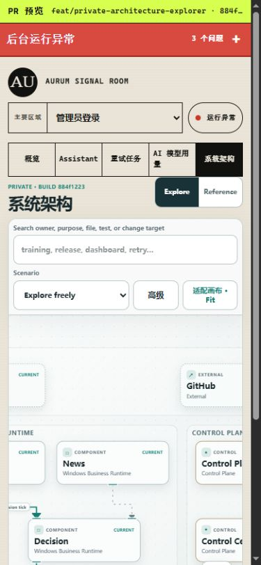

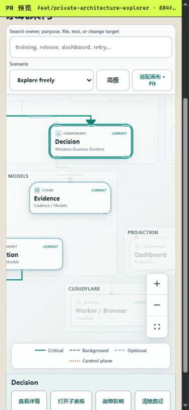

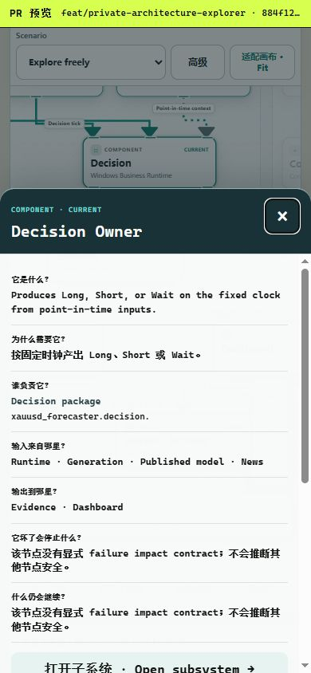

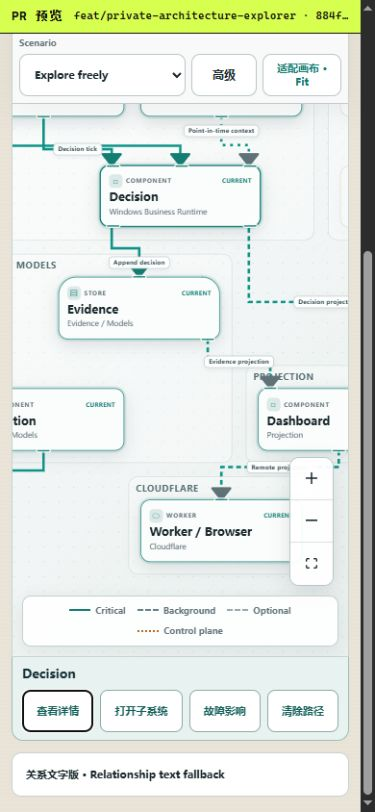

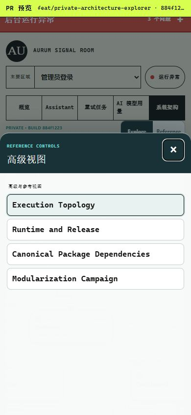

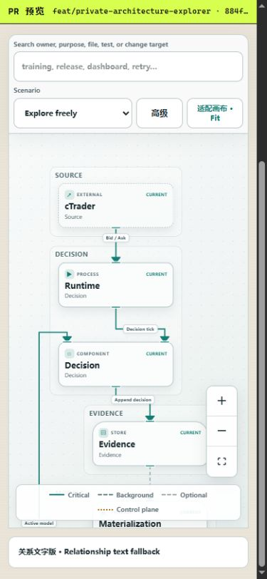

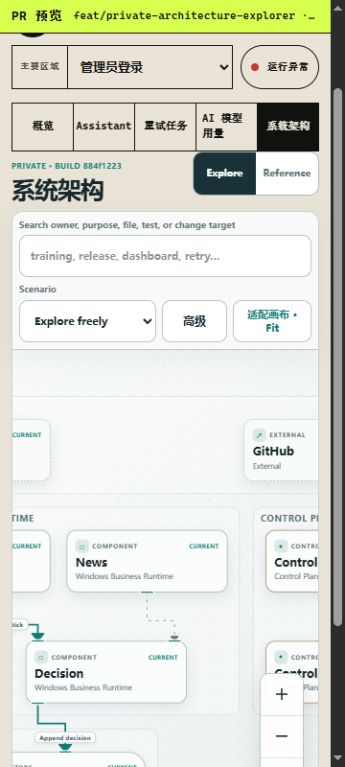

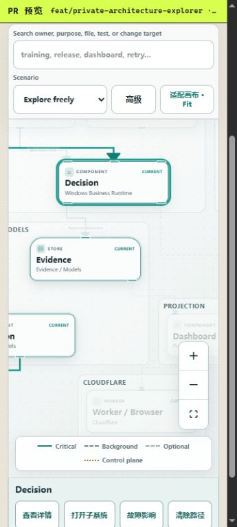

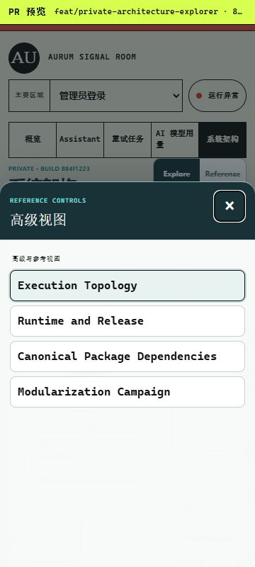

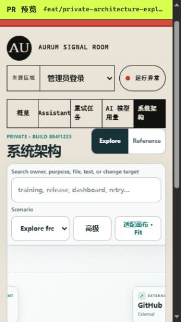

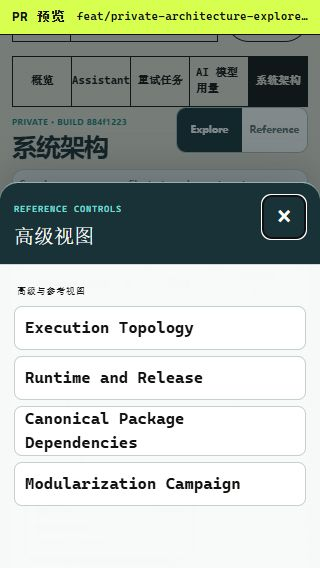

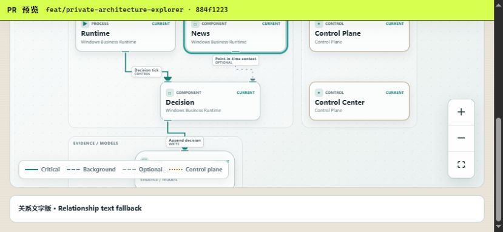

## External import compatibility

The bounded audit found no legacy `xauusd_forecaster.news` namespace import in
the repaired active stack or adjacent Calendar repositories. Other Forecaster
worktree hits and the two `automated-trading/src/XAUUSD-Forecaster` hits are
test-only retained snapshots. No accessible active runtime caller is broken,
so a compatibility facade is unnecessary. Unknown inaccessible consumers
cannot be proven absent.

## Remaining risks and concurrent work

- The stack remains `PENDING`; merging out of order is unsafe.
- #279 is open Draft and conflicting on `main`; after this campaign it must
  rebase and receive manual Control Center conflict review. Do not cherry-pick.
- #280 is open Draft on `main`; it must rebase Preview/build files after this
  campaign. Do not absorb its feature behavior.
- #281 is open Draft and conflicting on `main`; its review rules are
  complementary where not already represented, but it must rebase. Do not
  close it without authorization.
- #304's exact-head Python, Web, repository-policy, Windows runtime, and
  Workers Build checks are green. Every rewritten ancestor and #302 must still retain its required
  exact-head checks before merge readiness is claimed.

## Merge, rollback, and observation

Merge strictly:

```text
#282 -> #283 -> #285 -> #287 -> #288 -> #289 -> #290 -> #291 -> #292
-> #294 -> #295 -> #296 -> #297 -> #298 -> #299 -> #301 -> #304 -> #302
```

After each merge, retarget the next PR to the advanced base and verify its head
tree and required checks. Rollback is the exact reverse order. No database or
production-state rollback is required.

Post-merge observation must verify each merged SHA/check set, immutable-only
Cloudflare Versions, unchanged runtime/API semantics, independent service
health, the private Explorer under Access at desktop and both phone widths,
Assistant still `PAUSED`, and retention of the prior Stable/version revision.
Candidate staging or validation requires separate authorization; merging never
authorizes Promote or any production mutation.
