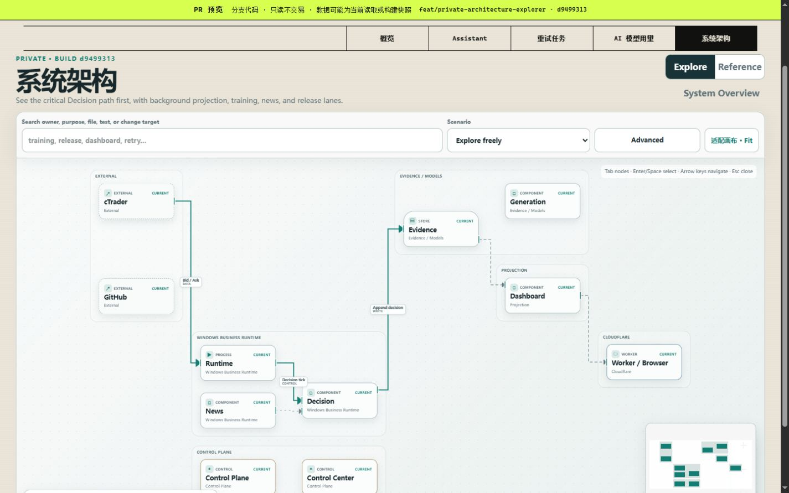
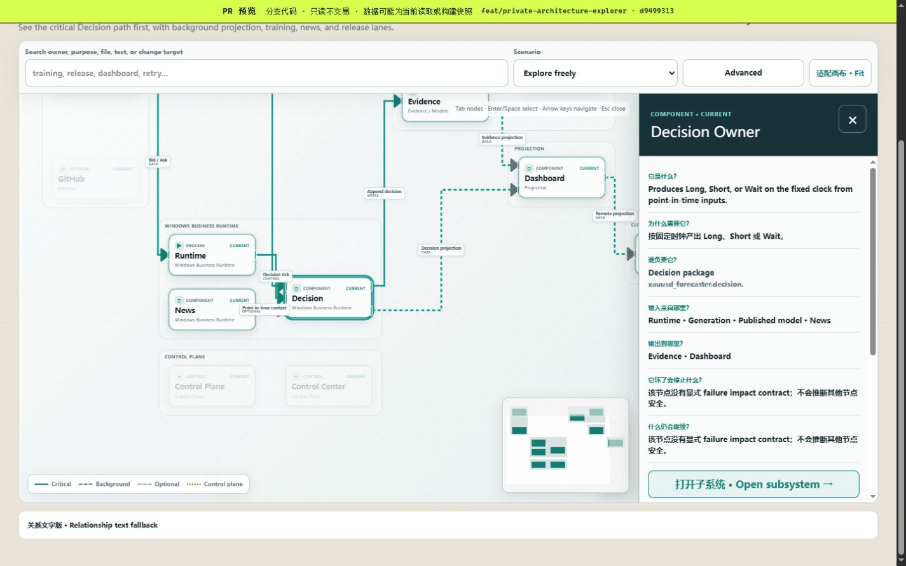
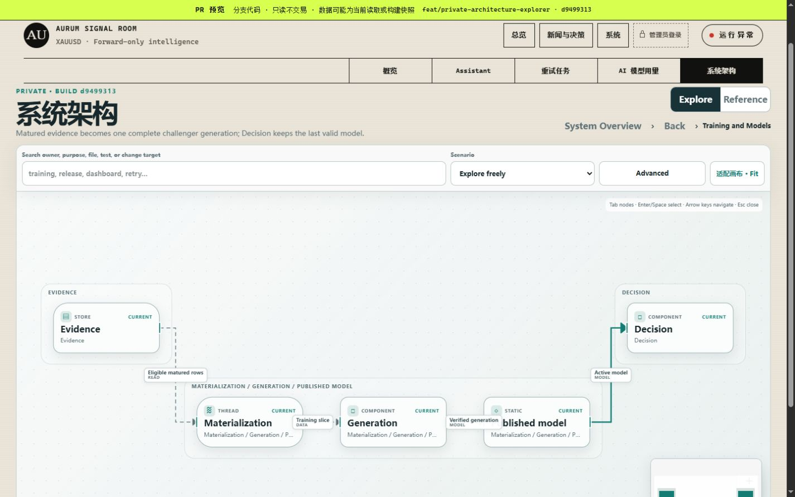
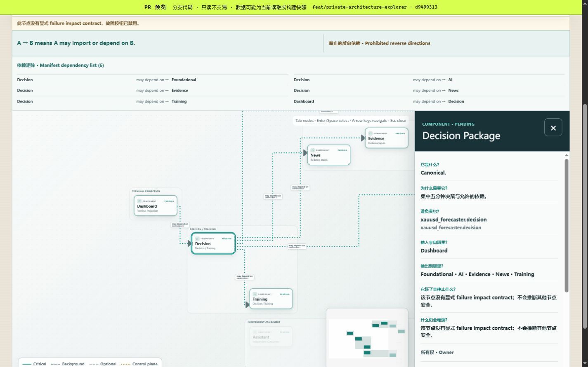
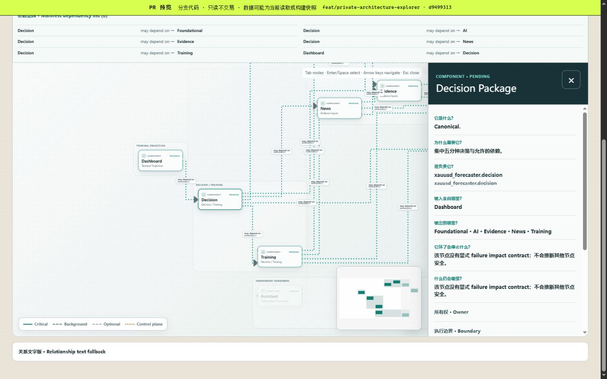
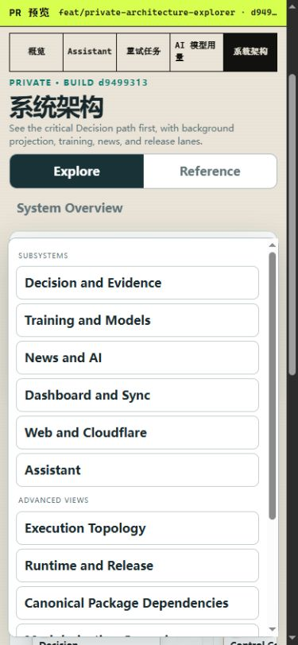
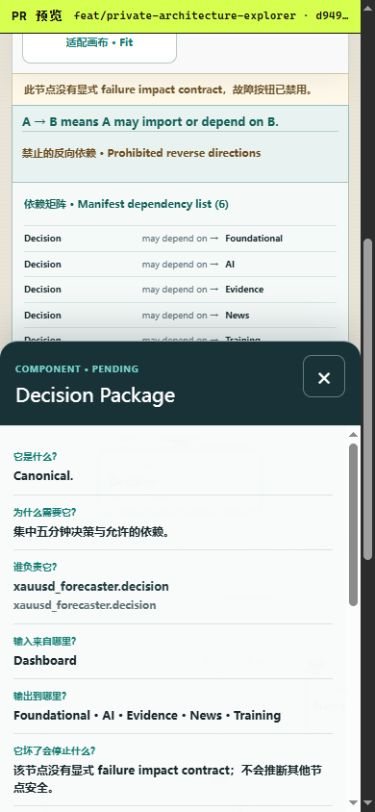
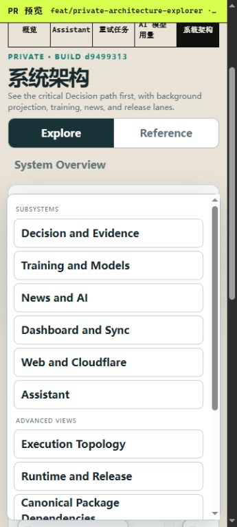
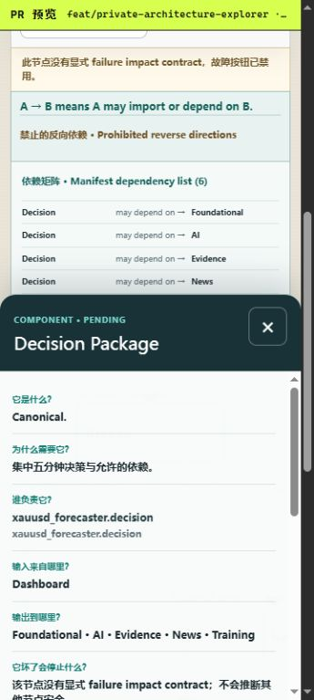

# Repository Modularization Closure Audit — 2026-08-24

## Status and scope

This is the closure manifest for the still-`PENDING` Draft PR stack. It does
not make the target package layout, test organization, or Architecture Explorer
`CURRENT`; those states change only after the ordered stack merges.

- Audited latest `main`: `0bc4c1f84e7b7f48e628f5111c56adb6ad824a2a`
- Final implementation head: #304 at `d949931351e9344c11fe83541e5afdc53283b45b`
- Closure: existing Draft PR #302, documentation-only, based on #304
- Complete Draft PR count: 18
- Campaign sequence from #287 through Closure: 15 Draft PRs
- Assistant: `PAUSED`

No merge, deployment, Stable traffic operation, provider call, production
database/queue/attempt mutation, Control Plane installation, service restart,
or production state change was performed.

## Architecture gate

```text
Owner: Repository architecture audit and handover
Authoritative state/store: Git history, Draft PR metadata, architecture maps, and test evidence
Execution boundary: Documentation and read-only validation only
Critical or optional: Optional documentation path; no production runtime path
Maximum work per operation: One bounded exact-head audit across 18 Draft PRs
Incremental cursor/revision/checkpoint: Exact branch head SHAs and GitHub check runs
Failure domain: Documentation accuracy and merge-order handover
Last-good/recovery behavior: Revert the closure documentation commit
Architecture documents affected: Modularization tracker and this closure audit
```

## Complete repaired stack

Each base SHA is the exact head of the immediate parent. The closure commit
cannot embed its own hash without changing that hash; its live PR head OID is
the authoritative value.

| Order | PR | Branch | Exact base SHA | Exact head SHA |
|---:|---:|---|---|---|
| 1 | #282 | `docs/architecture-baseline` | `0bc4c1f84e7b7f48e628f5111c56adb6ad824a2a` | `3ec3f8d4b30302a7ad0803cd3e0ab880bbda00f8` |
| 2 | #283 | `refactor/dashboard-status-cache` | `3ec3f8d4b30302a7ad0803cd3e0ab880bbda00f8` | `bc151d061ec0b673ecb4834344743dc4d2598b5e` |
| 3 | #285 | `refactor/dashboard-health-projection` | `bc151d061ec0b673ecb4834344743dc4d2598b5e` | `123fd495657c2a9f524dff1bddc1138bd745a931` |
| 4 | #287 | `refactor/dashboard-resource-contracts` | `123fd495657c2a9f524dff1bddc1138bd745a931` | `24b07b947c4523884eabdcfc75f8aa3123f9ea38` |
| 5 | #288 | `refactor/dashboard-api-news-resources` | `24b07b947c4523884eabdcfc75f8aa3123f9ea38` | `4f7d6aadba8cdf40a06ce24f37b9f112107f3f16` |
| 6 | #289 | `refactor/dashboard-api-market-resources` | `4f7d6aadba8cdf40a06ce24f37b9f112107f3f16` | `d062854327366e8a109d28ae8b13367a1c6c2dae` |
| 7 | #290 | `refactor/dashboard-api-optional-resources` | `d062854327366e8a109d28ae8b13367a1c6c2dae` | `676ebf4497aebd0d4ba4012e08be2cbd7926ea90` |
| 8 | #291 | `refactor/dashboard-operator-bridge` | `676ebf4497aebd0d4ba4012e08be2cbd7926ea90` | `4475923781814a55520a2f9d24a51e22b44d2575` |
| 9 | #292 | `refactor/dashboard-sync-runtime` | `4475923781814a55520a2f9d24a51e22b44d2575` | `290586f0ed06da76406fd485590a48826280b117` |
| 10 | #294 | `refactor/news-annotator-runtime` | `290586f0ed06da76406fd485590a48826280b117` | `c5aad43c85fcedecd200aea79e623202a7ae5262` |
| 11 | #295 | `refactor/control-center-boundaries` | `c5aad43c85fcedecd200aea79e623202a7ae5262` | `2f809e3e3fbe6deaadfa214aae5de132953a8397` |
| 12 | #296 | `refactor/decision-evidence-packages` | `2f809e3e3fbe6deaadfa214aae5de132953a8397` | `5c522cd34a69fa8c50dce72dad13014c728a9f99` |
| 13 | #297 | `refactor/training-package` | `5c522cd34a69fa8c50dce72dad13014c728a9f99` | `f0b876e50b2acf6953aad408389d2fb38362c764` |
| 14 | #298 | `refactor/news-ai-packages` | `f0b876e50b2acf6953aad408389d2fb38362c764` | `78ef970f1f13692cccf164d5b2bcfd60a7ca5b3b` |
| 15 | #299 | `refactor/assistant-runtime-dashboard-packages` | `78ef970f1f13692cccf164d5b2bcfd60a7ca5b3b` | `7587435b821fe78d87a729fe871de2e8422b168b` |
| 16 | #301 | `refactor/test-organization` | `7587435b821fe78d87a729fe871de2e8422b168b` | `386c38f3ef119dc9801fa104b2b8dd7bdf585b85` |
| 17 | #304 | `feat/private-architecture-explorer` | `386c38f3ef119dc9801fa104b2b8dd7bdf585b85` | `d949931351e9344c11fe83541e5afdc53283b45b` |
| 18 | #302 | `chore/modularization-campaign-closure` | `d949931351e9344c11fe83541e5afdc53283b45b` | live PR #302 head OID |

## Latest-main integration

The reconstruction includes the complete behavior merged through #284, #286,
#293, #300, #303, and #305 through #311:

- exact fetched `origin/main`, clean detached staging, complete bundle
  verification, watchdog handoff, rollback, and Business Runtime preservation;
- bounded retry only for transport, rate-limit, and server failures while auth,
  permission, invalid ref, missing commit, and reachability errors fail closed;
- exact child path/revision/hash identity, compatibility approval gates, WPF
  fallback only before first successful render, and exact validation-run CPU
  evidence with bounded telemetry propagation recovery;
- deterministic structured operation results, explicit semantic outcomes,
  atomic result transport, immutable completion evidence, exact Candidate/
  Stable proof, `INDETERMINATE` fallback, cleanup, and refresh ordering.

## Control Center and Control Plane proof

Latest-main `scripts/xauusd_control_center.ps1` was the behavioral source for
#295. PowerShell AST reconciliation maps all 210 functions exactly once:

- stable entry: zero functions; full parameter/constants/service/action
  composition plus three dot-sources;
- runtime owner: 73 functions;
- release owner: 94 functions;
- presentation owner: 43 functions;
- missing: 0; duplicates: 0; extras: 0; parse errors: 0;
- all tracked PowerShell files parse with zero errors.

`scripts/install_control_plane.ps1`, the installation runbook, nine-file
runtime-control bundle, and separate `tests/runtime/test_control_plane_install.py`
remain intact. Fourteen focused installer tests, the 219-case Control
Center/Control Plane family, and the 335-case exact Windows CI family passed.
The #295 PowerShell contract harness writes
UTF-8 with a BOM so
Windows PowerShell 5 preserves non-ASCII static-asset markers. No installer or
Control Center action was executed live.

## Test inventory reconciliation

| Inventory | Collected cases |
|---|---:|
| Latest `main` | 1,580 |
| Original pre-rebase Closure | 1,512 |
| Repaired #301 | 1,612 |
| Final implementation with Explorer | 1,633 |

Raw latest-main-to-#301 comparison produced 76 removed and 108 added node IDs.
Sixty-seven removals are identical logical symbols relocated with owner splits;
the remaining nine are individually mapped to equivalent-or-stronger nodes in
`docs/audits/TEST_ORGANIZATION_2026_08_24.md`. Unexplained removals are zero.
The final net increase over current main is 53: 32 campaign cases plus 21
Architecture Explorer manifest cases.

Final local evidence:

- Python platform-neutral CI gate: 1,414 passed; complete collection: 1,633;
- Web: 328 total, 322 passed, 6 skipped; build, scoped strict typecheck, and lint passed;
- exact Windows CI family: 335 passed; Control Center plus Control Plane: 219
  collected; Control Plane focused: 14 collected;
- Explorer: 72 tests, including 24 beginner-navigation and disclosure contracts;
  manifest validator: 21 tests; 37 nodes, 66 edges, 11 views, four scenarios,
  52,331 bytes;
- geometry contracts cover pairwise lane containment and 24px LR / 20px TB
  spacing, mobile branch topology, deterministic edge-specific anchors,
  exact port-to-route endpoints, node-safe orthogonal routes, and a 6px maximum
  partial collinear-overlap tolerance across every view and direction;
- mobile initial framing derives from graph/lane bounds and keeps 168px nodes,
  17px primary text, 13px lane headings, canvas-contained horizontal pan, and
  no page-level overflow; manual Fit retains the full overview;
- camera controller: ten behavioral cases cover initial/view/manual Fit, rapid
  cancellation, cross-view search/scenarios, scenario steps, inspector close,
  stale frames, and one-shot mobile TB initialization;
- semantic layout: deterministic LR/TB ranks and tracks, centered convergence,
  eight-pass global spacing bound, strict fail-closed validation, and automatic
  placement of a synthetic connected node omitted from all hints;
- lazy Explorer JS: 330,959 bytes / 98,876 gzip; lazy CSS: 35,505 / 6,938 gzip;
- public initial graph dependency delta: zero; graph packages remain lazy-only;
- architecture docs/imports/manifest, repository policy, compileall, PowerShell
  parse, and diff checks passed.

## Explorer and responsive proof

`/admin/architecture` remains behind the existing Admin/Access surface and is
statically prerendered. The manifest flows through a bounded build loader into
a lazy chunk. There is no public destination, Architecture API, D1 table,
Worker route, runtime GitHub request, Markdown parser, Windows process, or
background thread.

The exact #304 immutable Preview at
`https://253455b1-aurum-signal-room-preview.yiyousiow1234.workers.dev/admin/architecture`
was verified at 1440x900, 390x844, and 360x800. Version
`253455b1-a539-4f4b-8102-09f2698a9980` exposed the exact `d9499313`
build marker at every viewport.

The beginner-first Explore surface opens on System Overview instead of an
11-view selector. Search, scenarios, Advanced, and Fit remain directly
reachable. Advanced contains the Reference navigation and complete package
graph disclosure. System Overview shows its 11-node spine with six disclosed
edges; selecting Decision discloses eight related edges without changing the
camera zoom. Training shows five nodes, four edges, and three lanes. News,
Dashboard, and Runtime and Release show 6/5, 8/7, and 7/4 nodes/edges. Package
view starts with nine nodes and no inferred relationships, discloses six exact
incident dependencies for Decision, and exposes all 28 package dependencies
only on request. The adjacent dependency list is derived from the same six
selected edges.

Every visible routed endpoint matches its rendered port. Deterministic
edge-specific slots and the partial-overlap contract retain separate fan-in
routes through the Worker border; no hidden junction is introduced and both
arrowheads remain independently visible. The 72-case Explorer family protects
LR/TB port ownership, overlap tolerance, node-safe routing, semantic layout,
camera ownership, disclosure, and beginner navigation.

At both phone sizes, rendered nodes remain 168 CSS px wide, interactive targets
remain at least 44px, the graph pans horizontally inside React Flow, and the
page itself has no horizontal overflow. At 360x800, a 150px graph pan changed
the viewport x coordinate from -145.348 to -295.348 while retaining zoom
0.705882 and page overflow remained false. Package selection opens the fixed
bottom-sheet inspector without reducing the node readability floor. Canvas
height derives from graph and lane geometry rather than node count alone. The
viewport override was reset and the final task-created browser-session count
was zero. The known shared Admin-shell React hydration #418 remains
reproducible after reload; it predates this disclosure change and is recorded
rather than hidden.

Representative 1440x900 evidence:











Exact phone evidence:









The same evidence directory also retains Overview at both phone widths and the
desktop Dashboard, News, Runtime and Release, and initial Package states.

## External import compatibility

The bounded audit found no legacy `xauusd_forecaster.news` namespace import in
the repaired active stack or adjacent Calendar repositories. Other Forecaster
worktree hits and the two `automated-trading/src/XAUUSD-Forecaster` hits are
test-only retained snapshots. No accessible active runtime caller is broken,
so a compatibility facade is unnecessary. Unknown inaccessible consumers
cannot be proven absent.

## Remaining risks and concurrent work

- The stack remains `PENDING`; merging out of order is unsafe.
- #279 is open Draft and conflicting on `main`; after this campaign it must
  rebase and receive manual Control Center conflict review. Do not cherry-pick.
- #280 is open Draft on `main`; it must rebase Preview/build files after this
  campaign. Do not absorb its feature behavior.
- #281 is open Draft and conflicting on `main`; its review rules are
  complementary where not already represented, but it must rebase. Do not
  close it without authorization.
- #304's exact-head Python, Web, repository-policy, Windows runtime, and
  Workers Build checks are green. Every rewritten ancestor and #302 must still retain its required
  exact-head checks before merge readiness is claimed.

## Merge, rollback, and observation

Merge strictly:

```text
#282 -> #283 -> #285 -> #287 -> #288 -> #289 -> #290 -> #291 -> #292
-> #294 -> #295 -> #296 -> #297 -> #298 -> #299 -> #301 -> #304 -> #302
```

After each merge, retarget the next PR to the advanced base and verify its head
tree and required checks. Rollback is the exact reverse order. No database or
production-state rollback is required.

Post-merge observation must verify each merged SHA/check set, immutable-only
Cloudflare Versions, unchanged runtime/API semantics, independent service
health, the private Explorer under Access at desktop and both phone widths,
Assistant still `PAUSED`, and retention of the prior Stable/version revision.
Candidate staging or validation requires separate authorization; merging never
authorizes Promote or any production mutation.
